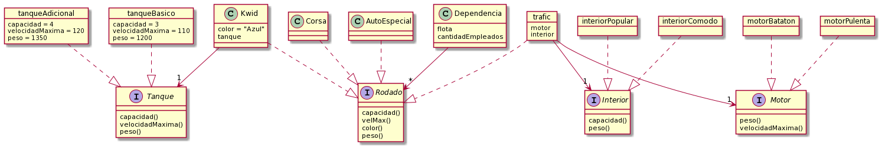

# Flotas de rodados

En este ejercicio vamos a construir un modelo que pueda servir para la administración de las flotas de rodados que utilizan las distintas dependencias de la Municipalidad de Coronel Vallejos. 

## Etapa 1 - Rodados y dependencias

De cada **rodado** nos van a interesar: _capacidad_ (o sea, cuántos pasajeros puede transportar), _velocidad máxima_, _color_ y _peso_.

A continuación se describen los rodados que maneja la muncipalidad.

- Varios **Chevrolet Corsa**.  
  La capacidad de estos autos es de 4 pasajeros, su velocidad máxima 150 km/h, y pesan 1300 kg.  
  La municipalidad no estableció un color fijo para sus Corsa; por lo tanto, debe informarse el color de cada uno.  

- Varios **Renault Kwid** que funcionan _a gas_. 
  Cada uno de ellos puede tener puesto, o no, un tanque adicional. 
  - La capacidad de un Kwid es de 4 pasajeros si no tiene puesto el tanque adicional, o 3 pasajeros si sí lo tiene puesto.
  - La velocidad máxima es 120 km/h con, o 110 km/h sin, tanque adicional.
  - El peso es 1200 kg, más 150 kg adicionales si tiene tanque adicional. 
  - Todos los autos de este tipo con que cuenta la municipalidad son azules.  

- **Una Trafic** (sí, una sola), que es reconfigurable, porque se le puede cambiar el interior y el motor.
  - La municipalidad cuenta con dos _interiores_, uno **cómodo** (capacidad 5 pasajeros, peso 700 kg) y otro **popular** (capacidad 12 pasajeros, peso 1000 kg). La municipalidad tiene un solo interior de cada tipo.
  - También ha comprado dos _motores_ para su Trafic, uno **pulenta** (que pesa 800 kg y permite una velocidad máxima de 130 km/h) y otro **batatón** (que pesa 500 kg y permite una velocidad máxima de 80 km/h). La municipalidad tiene un solo motor de cada tipo.
  - Varias características de la Trafic dependen de qué interior y qué motor le hayan puesto:
    - La _capacidad_ de la Trafic es la del interior.
    - La _velocidad máxima_ es la que permite el motor.
    - El peso es 4000 kg más el peso del interior más el del motor.
  - Finalmente, digamos que la Trafic es de _color blanco_, independientemente del interior y el motor que tenga puestos. 
  
- Varios **autos especiales** que son todos distintos entre sí. De cada uno de ellos se debe especificar capacidad, velocidad máxima, peso y color.

 

Como dijimos, cada **dependencia** de la municipalidad maneja una _flota de rodados_. Un rodado puede estar compartido entre varias dependencias (ver test más abajo). 
De cada dependencia importa también _cuántos empleados tiene_.
 
Debe ser posible enviarle los siguientes mensajes a cada objeto que representa a una dependencia.
- `agregarAFlota(rodado)` y `quitarDeFlota(rodado)`.
- `pesoTotalFlota()`, la suma del peso de cada rodado afectado a la flota.
- `estaBienEquipada()`, es verdadero si la flota tiene al menos 3 rodados, y además, _todos_ los rodados de la flota pueden ir al menos a 100 km/h.
- `capacidadTotalEnColor(color)`, la cantidad total de personas que puede transportar la flota afectada a la dependencia, considerando solamente los rodados del color indicado.
- `colorDelRodadoMasRapido()`, eso.
- `capacidadFaltante()`, que es el resultado de restar, de la cantidad de empleados, la capacidad sumada de los vehículos de la flota. 
- `esGrande()`, la condición es que la dependencia tenga al menos 40 empleados y 5 rodados.

### Test con dos dependencias

Armar un test en el que hay que se definen dos dependencias: deportes (45 empleados) y cultura (31 empleados).
	
En este test debe definirse un rodado al que llamaremos _cachito_; o sea, definir `var cachito = ...`.
Este rodado debe ser un Corsa de color rojo.
	
La flota de deportes incluye a: `cachito`, un Corsa azul, un Corsa verde, un Kwid con el tanque adicional puesto; y un auto especial con estas características: capacidad 5 pasajeros, velocidad máxima 160 km/h, peso 1200 kg, color beige.
	
Por su parte, cultura cuenta con: `cachito`; dos Kwid con el tanque adicional puesto; un Kwid más, este sin el tanque adicional;  y la Trafic, configurada con el interior popular y el motor batatón.
	
Notar que `cachito` forma parte de la flota de _ambas_ dependencias.

Para cada dependencia, hacer asserts sobre: el peso total de la flota, si está o no bien equipada, la capacidad total en color azul, el color del rodado más rápido, si es grande o no, y la capacidad faltante. 

Va una ayudita: la capacidad faltante de deportes es de 24 personas (la flota puede llevar: 12 personas en los 3 Corsa, más 4 del Kwid y 5 del auto especial; total 20), mientras que la de cultura es de 5 personas (puede llevar en total 26: 6 de los Kwid con tanque adicional, más 4 de la Kwid sin tanque, más 4 de cachito, más 12 de la Trafic dado que tiene el interior popular).	

 

## Etapa 2 - La muni se achica
Se conoce a la municipalidad, que maneja un monto de caja y conoce a todas sus dependencias. En ocasiones, precisa plata, y entonces vende un rodado.
Para modelar esto, tengamos en cuenta que ahora cada rodado tiene su valor. Y cuidado! No pueden quedar dependencias con capacidad faltante si vendemos el rodado, no deberíamos poder venderlo si es así.

Hacer al menos dos test, uno en el que venda y uno en que no pueda vender el rodado!

Link para submit de Plantuml, para continuar la clase que viene!: http://www.plantuml.com/plantuml/png/RLFBRkCW5Dtp5PPNCoCbocDcEL4UpIAgeaPLV-0M4uaASrt0RLNQVo-Fk63IbV4vbyCvtCjQ6r2cRmKvICFK6IYhxh611YsXq07bRlthDtbXuWXlRa5He7BVZcbqdqz2TWAqhdQeDDZqV_lA6nkhg_zLlNdlHKqCoEUU-QAxnoT6JMKKd3crf4M3Yd1lWQDAAflUu5vtZ78GNdp0RrZ7PCEamoqv2pH0A4ZZpUxRJZ3dN_lo5EeX77qL2iFQHUCjf5H-AqQ7qV8MDAVvbRXCotA_m-RpMT3moyLiTgMpQJZbA46CfVx-9BL8Kij_GMhG6kxfX5qlG5d7bTGEMspGZk_WS26pmrFcf16QSUe5amOiAOaj630e8v6qZvwpWrWH9yh7PbUJoQgUrzzc2ZZea76CQZhzMAKDHVo2pTr7AahcvdCyRt34uwYGecCZpa_tuFW2XGSGY-83YaKPC2JDeNp0HqGsuU6WF_N0h1tUj-8B
